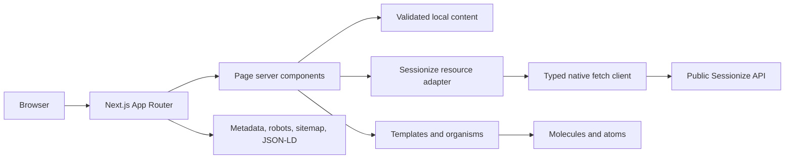

# Current architecture

The application is a small read-heavy Next.js frontend. Its current boundaries are proportional and no generic clean-architecture rewrite is justified.

## Runtime entrypoints

- `app/layout.tsx` supplies the root document and shared navigation/footer.
- `app/page.tsx` and current routes render the active edition.
- `app/editions/[year]/` renders archived editions.
- `app/robots.ts`, `app/sitemap.ts`, and `app/opengraph-image.tsx` generate discovery assets.
- `lib/content/` reads version-controlled edition content.
- `lib/api/sessionize.ts` validates and maps public Sessionize data.

There are no controllers, repositories, database entities, queues, AWS SDK clients, authentication services, or persistent side effects.
