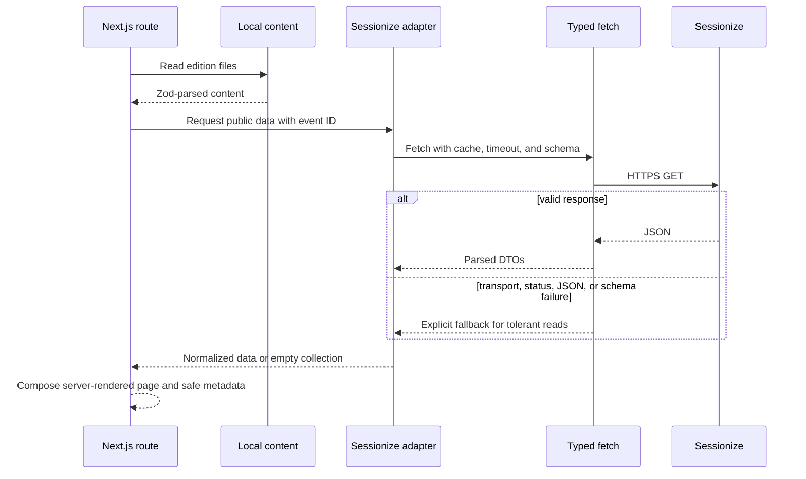

# Data and control flows

## Page generation

## Trust boundaries and failure paths

- Repository content crosses a filesystem-to-schema boundary.
- Sessionize crosses an Internet-to-schema boundary and is always untrusted.
- Environment variables cross a process-to-configuration boundary.
- JSON-LD crosses a data-to-HTML execution boundary and requires safe serialization.
- External registration/CFP/sponsor links cross a browser navigation boundary.

Sessionize failures intentionally degrade to explicit empty states for the current read path. No automatic retry is added without quota and latency evidence. Static local content is independent of external availability.
